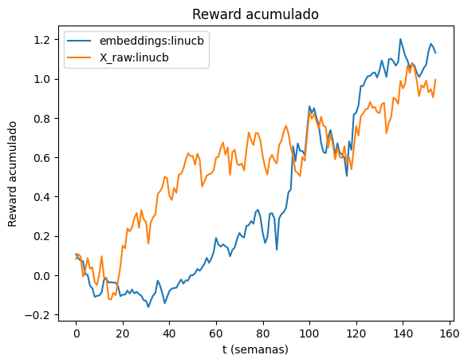
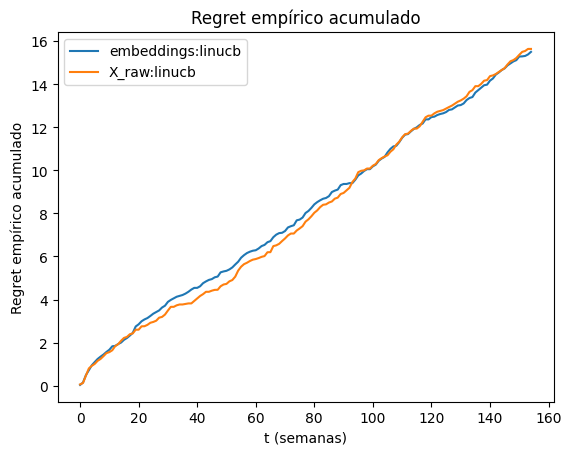
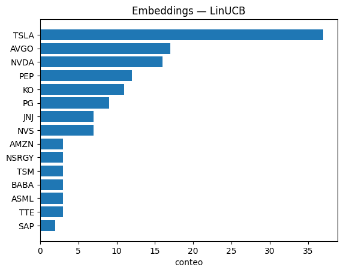
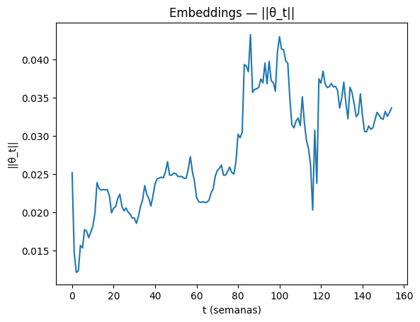

# GAT-LINUCB: Graph Attention Networks + Contextual Bandits for Asset Selection


A reproducible machine learning pipeline that combines **Graph Attention Networks (GAT)** and **contextual bandits (LinUCB)** for sequential asset selection in financial markets.

The core hypothesis: representing the market as a **dynamic graph of correlated assets** and learning **graph-aware embeddings** produces better context for bandit-based decision-making than raw price features alone.

---

## Results

### Cumulative Reward — LinUCB: Embeddings vs Raw Features



LinUCB with GAT embeddings (`cum_reward = 1.13`) outperforms LinUCB with raw features (`cum_reward = 0.99`) over 155 weeks of sequential selection.

### Policy Comparison (Embeddings context, d=16)

| Policy | Cum. Reward | Cum. Regret | Repeat Rate |
|---|---|---|---|
| **LinUCB** | **1.131** | 15.508 | 0.364 |
| Random | 0.247 | 16.393 | 0.013 |
| Greedy | -0.427 | 17.067 | 0.435 |

LinUCB achieves the highest cumulative reward and lowest regret. Greedy collapses due to over-exploitation (repeat rate 0.44).

### Cumulative Regret — Embeddings vs Raw Features



Both feature representations produce similar regret trajectories, suggesting the advantage of embeddings comes from reward quality, not exploration efficiency.

### Asset Selection Distribution (Embeddings — LinUCB)



LinUCB maintains a diversified portfolio: TSLA leads at 24% but the agent selects across 15+ assets, avoiding full concentration.

### Parameter Norm Evolution (||θ_t||)



θ_t grows steadily over time, reflecting continuous learning from weekly market feedback without divergence.

---

## Pipeline

```
Yahoo Finance prices
        │
        ▼
Weekly adjusted close prices
        │
        ▼
Weekly returns
        │
        ▼
Rolling correlation matrices
        │
        ▼
Graph snapshots (one per week)
        │
        ▼
Graph Attention Network (GAT)
        │
        ▼
Asset embeddings (d=16)
        │
        ▼
Contextual bandits (LinUCB / Greedy / Random)
        │
        ▼
Sequential asset selection + regret evaluation
```

---

## Architecture

### Graph Construction

Each week, assets are connected based on rolling return correlations. This produces a dynamic graph where edge weights reflect co-movement strength — capturing sector clustering and regime changes over time.

### Node Features

Each asset node is described by momentum and volatility features, combined with graph structure through the attention mechanism.

### GAT Embeddings

Graph Attention Networks produce embeddings that encode:
- Asset co-movement patterns
- Sector-like clustering
- Dynamic structural relationships

These embeddings serve as context vectors for the bandit algorithms.

### Contextual Bandits

Three policies are evaluated under the same market sequence:

| Policy | Strategy |
|---|---|
| **LinUCB** | Upper Confidence Bound — balances exploration and exploitation |
| **Greedy** | Always selects the highest estimated reward asset |
| **Random** | Uniform random selection (baseline) |

Rewards are the realized weekly returns of the selected asset.

---

## Quick Start

```bash
git clone https://github.com/agarcia1607/GAT-LINUCB
cd GAT-LINUCB

python -m venv .venv
source .venv/bin/activate  # Windows: .venv\Scripts\activate
pip install -r requirements.txt
```

Run the full pipeline:
```bash
python run_pipeline.py
```

Run bandit experiments:
```bash
python run_bandits.py
```

---

## Project Structure

```
GAT-LINUCB/
├── src/
│   ├── block3/
│   │   └── embed.py          # GAT embedding generation
│   └── 02_prepare_weekly_adjclose.py
├── notebooks/
│   └── analysis_linucb.ipynb # Full analysis and visualizations
├── reports/                  # Result figures
├── run_pipeline.py           # End-to-end pipeline
├── run_bandits.py            # Bandit experiments
├── config.py
├── requirements.txt
└── Dockerfile
```

Generated artifacts (`artifacts/`, `data/`, `logs/`) are excluded from version control — fully reproducible by running the pipeline.

---

## Experiment Setup

- **Period:** January 2023 – present (weekly frequency)
- **Universe:** S&P 500 constituents + global ETFs
- **Embedding dimension:** d=16 (GAT) vs d=2 (raw features)
- **Evaluation:** Cumulative reward, empirical regret, repeat rate, θ_t norm evolution

---

## Stack

`Python` · `PyTorch` · `PyTorch Geometric` · `Scikit-learn` · `Pandas` · `NumPy` · `Matplotlib` · `Docker` · `AWS`

---

## Research Context

This project sits at the intersection of graph neural networks, financial network modeling, and online learning. It explores whether **graph-aware asset representations improve sequential decision-making** compared to traditional feature-based approaches.

Related areas: temporal graph networks, portfolio optimization, multi-armed bandits, reinforcement learning for finance.

---

## Future Work

- EXP3 bandits for adversarial settings
- Combinatorial bandits for portfolio-level selection
- Risk-adjusted reward functions (Sharpe ratio)
- Dynamic graph models (evolving edge weights)
- RAGAS-style evaluation framework

---

## Author

**Andrés García** · Computer Scientist · Universidad Nacional de Colombia  
[GitHub](https://github.com/agarcia1607) · [LinkedIn](https://www.linkedin.com/in/andrés-felipe-garcía-orrego-17965b218)

## License

MIT
