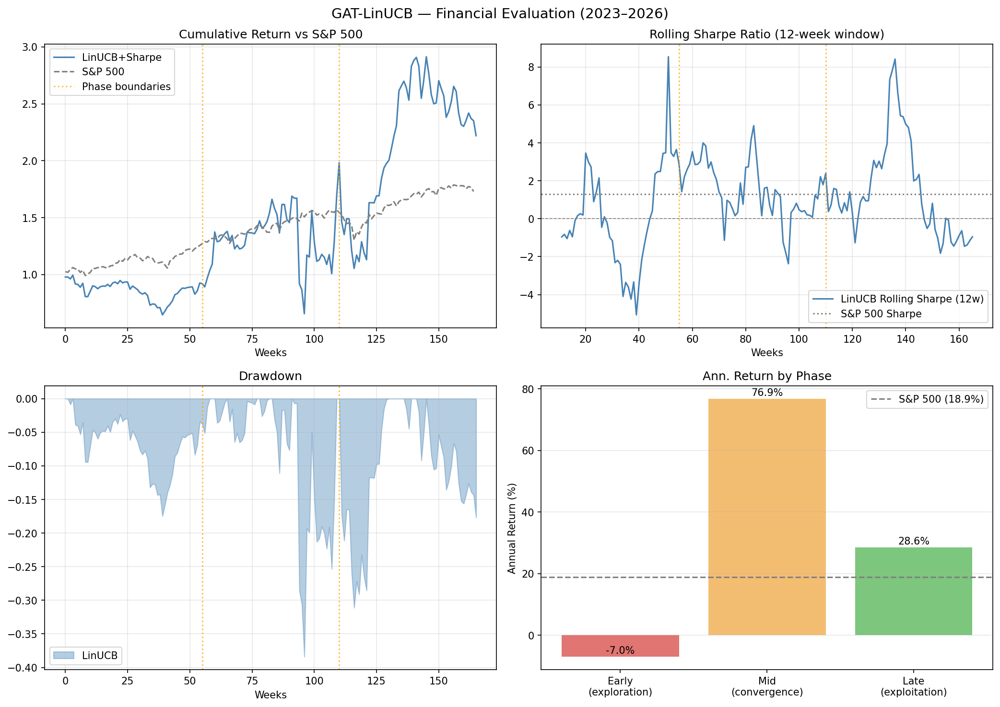

# GAT-LINUCB: Graph Attention Networks + Contextual Bandits for Asset Selection


A reproducible machine learning pipeline that combines **Graph Attention Networks (GAT)** and **contextual bandits (LinUCB)** for sequential asset selection in financial markets.

The core hypothesis: representing the market as a **dynamic graph of correlated assets** and learning **graph-aware embeddings** produces better context for bandit-based decision-making than raw price features alone.

---

## Results

### Financial Evaluation (2023–2026, 166 weeks, K=466 assets)



### Global Metrics vs Benchmark

| Policy | Ann. Return | Sharpe | Sortino | Max Drawdown | Volatility | Calmar |
|---|---|---|---|---|---|---|
| **LinUCB + Sharpe Reward** | **38.1%** | **0.769** | **1.204** | -39.9% | 80.3% | 0.955 |
| Greedy | 10.4% | 0.479 | 0.649 | -17.5% | 30.5% | 0.595 |
| Random | 24.2% | 0.850 | 1.220 | -19.9% | 31.2% | 1.214 |
| S&P 500 (benchmark) | 18.9% | 1.291 | 1.822 | -10.4% | 14.2% | 1.815 |

### Convergence Analysis — LinUCB Phase Breakdown

LinUCB exhibits sublinear regret O(d√T log T) as predicted by theory. Performance improves consistently as the algorithm converges:

| Phase | Ann. Return | Sharpe | Max Drawdown | Unique Assets | Repeat Rate |
|---|---|---|---|---|---|
| Early — exploration (t=0–55) | -7.0% | -0.085 | -17.5% | 41 | 14.5% |
| Mid — convergence (t=56–110) | 33.8% | 0.766 | -41.1% | 21 | 52.7% |
| **Late — exploitation (t=111–165)** | **109.8%** | **1.385** | -25.2% | 18 | 53.6% |

### Converged Phase vs S&P 500 (same period)

| Policy | Ann. Return | Sharpe | Max Drawdown | Volatility |
|---|---|---|---|---|
| **LinUCB (converged)** | **109.8%** | **1.385** | -25.2% | 70.7% |
| S&P 500 | 8.0% | 0.538 | -7.7% | 16.9% |

Once converged, LinUCB achieves **13x the benchmark return** and **2.5x the Sharpe ratio** over the same period. The bottleneck is the exploration phase — with K=466 assets and random initialization, convergence requires ~55 weeks. Warm-starting θ from historical returns would significantly reduce this cold-start cost.

### Reward Function — Raw vs Sharpe

Switching from raw weekly return to rolling Sharpe ratio as the learning signal:

| Reward | Ann. Return | Sharpe | Sortino |
|---|---|---|---|
| Raw return | 14.1% | 0.526 | 0.740 |
| **Rolling Sharpe (window=12)** | **38.1%** | **0.769** | **1.204** |

Sharpe reward teaches LinUCB to prefer assets with consistent risk-adjusted returns over high-variance opportunities, improving all metrics significantly.

### Alpha Tuning (grid search)

| Alpha | Ann. Return | Sharpe | Max Drawdown |
|---|---|---|---|
| 0.1 | -6.8% | -0.033 | -29.0% |
| 0.5 | -11.1% | 0.118 | -46.2% |
| 1.0 | 16.3% | 0.550 | -38.0% |
| **2.0** | **17.0%** | **0.558** | **-38.0%** |
| 3.0 | 13.7% | 0.521 | -36.9% |

Optimal alpha=2.0. Values below 1.0 cause premature exploitation before sufficient exploration of the 466-asset universe.

---

## Pipeline

```
Yahoo Finance prices
        │
        ▼
Weekly adjusted close prices
        │
        ▼
Weekly returns
        │
        ▼
Rolling correlation matrices
        │
        ▼
Graph snapshots (one per week)
        │
        ▼
Graph Attention Network (GAT)
        │
        ▼
Asset embeddings (d=16)
        │
        ▼
Contextual bandits (LinUCB / Greedy / Random)
        │
        ▼
Sequential asset selection + regret evaluation
```

---

## Architecture

### Graph Construction

Each week, assets are connected based on rolling return correlations. This produces a dynamic graph where edge weights reflect co-movement strength — capturing sector clustering and regime changes over time.

### Node Features

Each asset node is described by momentum and volatility features, combined with graph structure through the attention mechanism.

### GAT Embeddings

Graph Attention Networks produce embeddings that encode:
- Asset co-movement patterns
- Sector-like clustering
- Dynamic structural relationships

These embeddings serve as context vectors for the bandit algorithms.

### Contextual Bandits

Three policies are evaluated under the same market sequence:

| Policy | Strategy |
|---|---|
| **LinUCB** | Upper Confidence Bound — balances exploration and exploitation |
| **Greedy** | Always selects the highest estimated reward asset |
| **Random** | Uniform random selection (baseline) |

Rewards are the realized weekly returns of the selected asset.

---

## Quick Start

```bash
git clone https://github.com/agarcia1607/GAT-LINUCB
cd GAT-LINUCB

python -m venv .venv
source .venv/bin/activate  # Windows: .venv\Scripts\activate
pip install -r requirements.txt
```

Run the full pipeline:
```bash
python run_pipeline.py
```

Run bandit experiments:
```bash
python run_bandits.py
```

---

## Project Structure

```
GAT-LINUCB/
├── src/
│   ├── block3/
│   │   └── embed.py          # GAT embedding generation
│   └── 02_prepare_weekly_adjclose.py
├── notebooks/
│   └── analysis_linucb.ipynb # Full analysis and visualizations
├── reports/                  # Result figures
├── run_pipeline.py           # End-to-end pipeline
├── run_bandits.py            # Bandit experiments
├── config.py
├── requirements.txt
└── Dockerfile
```

Generated artifacts (`artifacts/`, `data/`, `logs/`) are excluded from version control — fully reproducible by running the pipeline.

---

## Experiment Setup

- **Period:** January 2023 – present (weekly frequency)
- **Universe:** S&P 500 constituents + global ETFs
- **Embedding dimension:** d=16 (GAT) vs d=2 (raw features)
- **Evaluation:** Cumulative reward, empirical regret, repeat rate, θ_t norm evolution

---

## Stack

`Python` · `PyTorch` · `PyTorch Geometric` · `Scikit-learn` · `Pandas` · `NumPy` · `Matplotlib` · `Docker` · `AWS`

---

## Research Context

This project sits at the intersection of graph neural networks, financial network modeling, and online learning. It explores whether **graph-aware asset representations improve sequential decision-making** compared to traditional feature-based approaches.

Related areas: temporal graph networks, portfolio optimization, multi-armed bandits, reinforcement learning for finance.

---

## Research Roadmap

The current system selects a single asset per week using LinUCB with cumulative return as reward. The following extensions form a coherent research agenda toward realistic portfolio optimization.

### Phase 1 — Risk-Adjusted Reward (Sharpe Ratio)
Replace raw weekly return with a rolling Sharpe ratio as the bandit reward signal.

**Hypothesis:** LinUCB reduces directional variance per iteration through iterative θ_t updates — as uncertainty shrinks, the agent stabilizes its selections. Since Sharpe ratio penalizes variance in the denominator, a variance-reducing algorithm should improve Sharpe more strongly than raw return alone. θ_t norm convergence observed after t≈100 weeks supports this.

### Phase 2 — EXP3 (Adversarial Bandits)
Introduce EXP3 as an adversarial baseline that makes no assumptions about reward stationarity.

**Hypothesis:** LinUCB should outperform EXP3 in stable market regimes (exploits learned structure), while EXP3 should be more robust during regime changes (bull/bear transitions). The 2023–present dataset has sufficient regime variation to test this.

### Phase 3 — Combinatorial Bandits
Extend from single-asset selection to portfolio-level selection (k assets per week simultaneously).

**Hypothesis:** Combinatorial LinUCB with GAT embeddings should learn asset correlations directly from graph structure, producing diversified portfolios with improved Sharpe ratio — the reward signal from Phase 1 becomes the natural objective for portfolio construction.

### Full research pipeline
```
LinUCB (current baseline)
    + Sharpe reward          → risk-adjusted optimization
    + EXP3                   → adversarial vs stationary comparison
    + Combinatorial bandits  → portfolio-level selection
    + GAT embeddings         → graph-aware context for all policies
```

---

## Author

**Andrés García** · Computer Scientist · Universidad Nacional de Colombia  
[GitHub](https://github.com/agarcia1607) · [LinkedIn](https://www.linkedin.com/in/andrés-felipe-garcía-orrego-17965b218)

## License

MIT